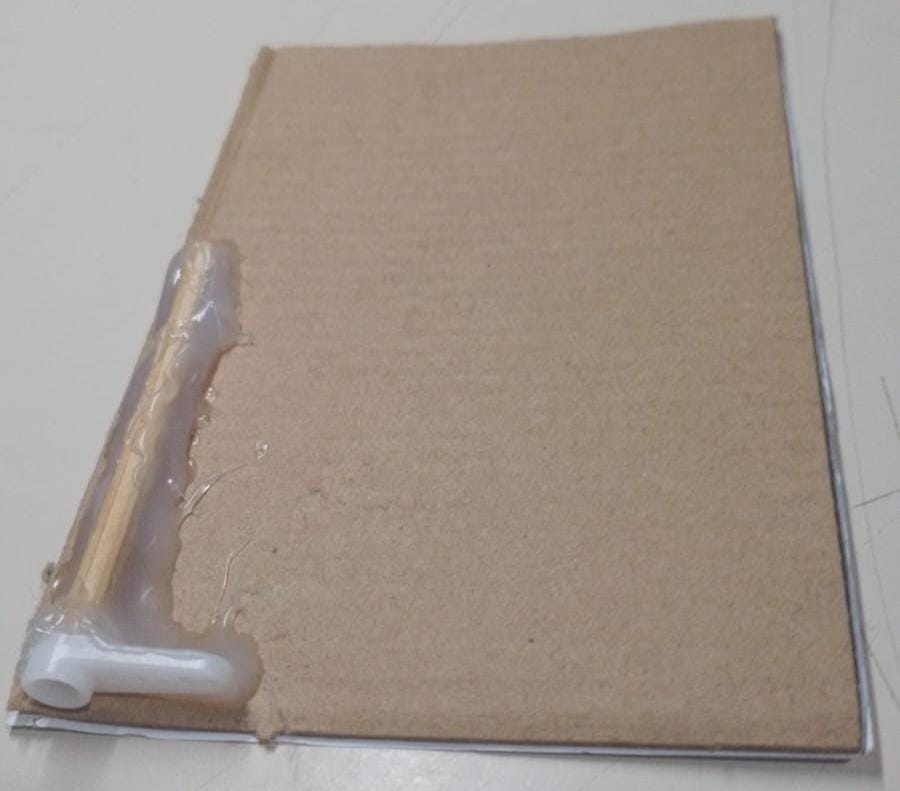
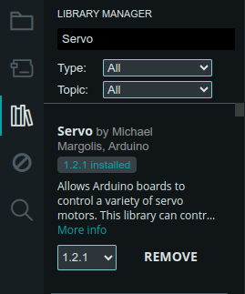

# Cochera inteligente con Arduino

Este proyecto es una pequeña cochera inteligente hecha con Arduino. La función del proyecto es controlar la puerta de la cochera con un sensor de ultrasonido, esto le permite abrir o cerrar la cochera con un servomotor sin necesidad de presionar un botón.

Cuando el sensor detecte un objeto a menos de 16 cm, la puerta se abre y se mantiene abierta durante 4 segundos y despues se cierra, al cerrar la puerta pasa 1 segundo para que el sensor pueda detectar un nuevo objeto.

## Cochera en funcionamiento

Para colocar la puerta se pega el servomotor junto a una pared de la cochera por dentro, hay que cuidar que sobre salga lo suficiente para pegar el aspa a la puerta y que pueda girar el servomotor.

## ¿Cómo usar?
Primero se debe descargar el proyecto y abrir el IDE de Arduino, dentro de este se debe buscar e instalar la librería Servo. Una vez que se haya instalado se puede abrir el proyecto se puede subir el código a la placa Arduino y se encendera la puerta.

 
 

### Cochera en funcionamiento

